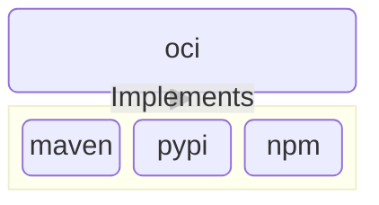
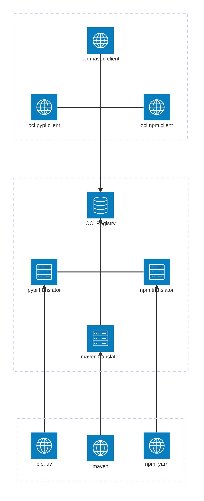

# package-dist

A universal software package distribution standard and toolchain.

## How it works

`package-dist` uses the [OCI Image Specification](https://github.com/opencontainers/image-spec) as a
common schema to define and distribute any [software package](https://slsa.dev/spec/v1.2/terminology#distribution-model).
Each software package ecosystem (ex: Apache Maven, Python PyPI packages, npm) specifies its own
_representation_ within an OCI [image manifest](https://github.com/opencontainers/image-spec/blob/v1.1.1/manifest.md).

These representations are used to create _client tools_ that natively publish and retrieve software
packages in OCI format, as well as _translation servers_ that provide backwards-compatibility with
existing package ecosystem toolchains.

